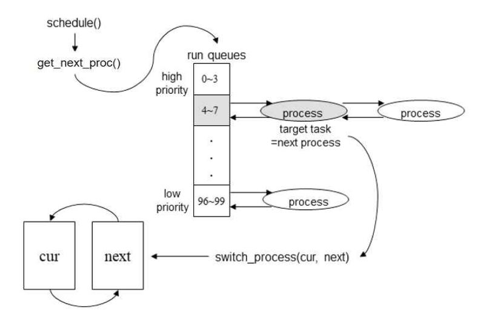
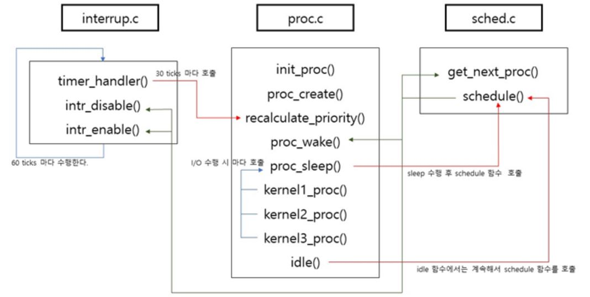

## Scheduling

FreeBSD 5.4 이후 구현된 ULE 구현

> 프로세스의 우선순위 + 프로세스가 사용한 CPU 시간을 스케줄링에 반영함

 

### 스케줄러 동작방식 (구현부)

(1) priority 값은 0~99

(2) 0번 idle 프로세스는 schedule() 함수 호출

(3) 우선순위 값(=priority 값)이 낮을 수록 우선순위 높음

(4) run Queue 에는 우선순위 4개 포함

(5) I/O 요청 시 프로세스 상태 변경 후 schedule() 호출

(6) 매 클럭 tick 마다 time_slice, time_used 값을 증가시켜 CPU 사용량 재개산

(7) priority 값 변경 후 run Queue 의 index 재계산해서 맨 마지막에 삽입

 

### 구현 부 구성도

